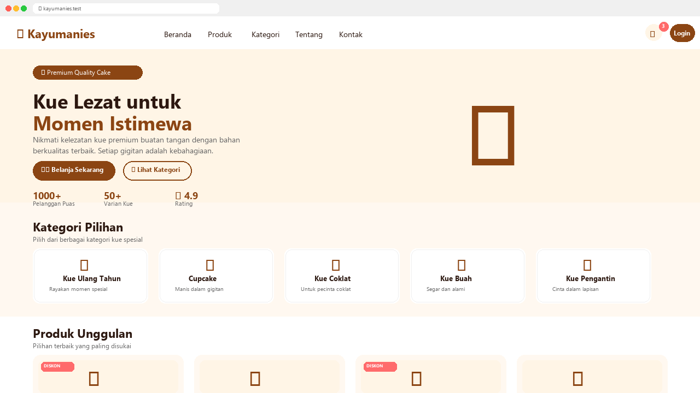
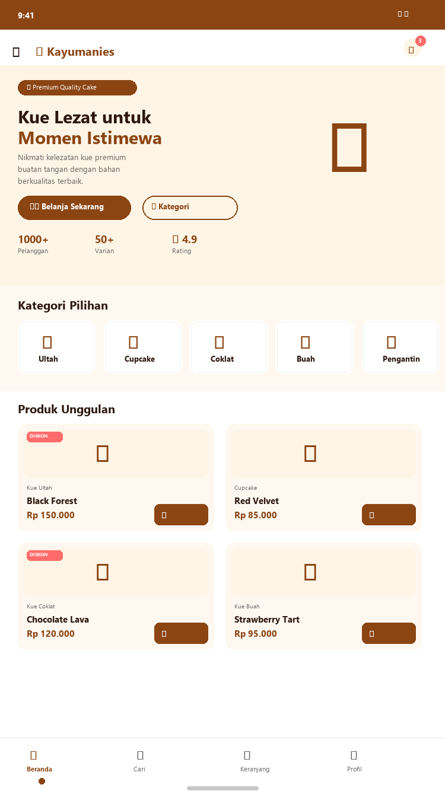

# 🍰 Kayumanies - Sistem Informasi Toko Kue Online

**Kayumanies** adalah sistem informasi toko kue *online* yang dibangun dengan arsitektur **multi-level user** — **Admin**, **Kasir**, dan **Pembeli**. Setiap level memiliki hak akses dan tampilan antarmuka yang berbeda sesuai dengan perannya masing-masing. Dibangun sebagai riset mandiri untuk mengembangkan solusi e-commerce yang modern, responsif, dan mudah digunakan.

---

## ✨ Fitur Utama

- 🏪 **Multi-Toko** — Mendukung banyak penjual (vendor) dalam satu platform
- 🛒 **Sistem Keranjang Belanja** — Manajemen pesanan yang terintegrasi
- 💬 **Chat Real-time** — Komunikasi antara pembeli dan penjual
- ⭐ **Review & Rating** — Ulasan produk dari pembeli
- 📱 **PWA (Progressive Web App)** — Dapat diinstal sebagai aplikasi mobile
- 🔐 **Multi-Level User** — Admin, Kasir, dan Pembeli
- 🎨 **Tema Dinamis** — Tampilan yang dapat disesuaikan
- 🔒 **Keamanan** — Sistem keamanan dan proteksi akses

---

## 📸 Tampilan Aplikasi

### Desktop View

*Tampilan desktop Kayumanies — navigasi lengkap, hero section, kategori, dan produk unggulan*

### Mobile / PWA View

*Tampilan mobile Kayumanies — dioptimalkan untuk perangkat sentuh dengan bottom navigation*

> Kayumanies mendukung **Progressive Web App (PWA)** sehingga dapat diinstal langsung ke perangkat mobile dan desktop seperti aplikasi native.

---

## 🏗️ Arsitektur Sistem

```
kayumanies/
├── api/              # REST API endpoints
├── assets/           # Aset statis (CSS, JS, Gambar, Uploads)
├── config/           # Konfigurasi database & aplikasi
├── database/         # Skema database
├── includes/         # Komponen reusable (navbar, footer, dll)
├── logs/             # Log aplikasi
├── modules/          # Modul berdasarkan role
│   ├── admin/        # Panel administrator
│   ├── auth/         # Autentikasi & otorisasi
│   ├── kasir/        # Panel kasir
│   └── pembeli/      # Panel pembeli
└── Nothings/         # Dokumentasi teknis
```

---

## 🛠️ Teknologi

| Teknologi | Keterangan |
|-----------|------------|
| **PHP** | Bahasa pemrograman backend |
| **MySQL** | Database management system |
| **HTML5/CSS3/JS** | Frontend development |
| **PWA** | Progressive Web App support |
| **AJAX** | Komunikasi asynchronous |
| **REST API** | Arsitektur API |

---

## ⚙️ Instalasi

### Prasyarat
- PHP 7.4 atau lebih baru
- MySQL 5.7 atau lebih baru
- Web Server (Apache / Nginx)

### Langkah Instalasi

1. **Clone repository**
   ```bash
   git clone https://github.com/xdr7/Kayumanies.git
   cd Kayumanies
   ```

2. **Import database**
   - Buat database MySQL baru
   - Import `database/kayumanies_db.sql`

3. **Konfigurasi**
   - Salin `config/database.example.php` ke `config/database.php`
   - Sesuaikan konfigurasi database

4. **Jalankan**
   - Akses melalui web server lokal (XAMPP/Laragon/dll)
   - Buka `http://localhost/kayumanies`

---

## 👨‍💻 Pengembang

**Asmaul Asni Subegi, S.Kom**  
*Computer Science Alumni*  
Fakultas Matematika dan Ilmu Pengetahuan Alam  
Universitas Mulawarman, Samarinda, Kalimantan Timur

> *Riset mandiri — Platform toko kue online dengan sistem multi-toko*

---

## 📄 Lisensi

Hak Cipta © 2024 Asmaul Asni Subegi, S.Kom

Didistribusikan di bawah lisensi **MIT License**. Lihat file `LICENSE` untuk informasi lebih lanjut.

---

## 📞 Kontak

- **Email**: [asmaul.subegi@example.com](mailto:asmaul.subegi@example.com)
- **Universitas**: [Universitas Mulawarman](https://unmul.ac.id)
- **Lokasi**: Samarinda, Kalimantan Timur, Indonesia
